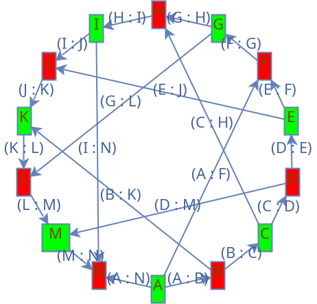

# Решение задачи раскраски графа с использованием генетического алгоритма

Этот проект предоставляет реализацию задачи раскраски графа с использованием **генетического алгоритма**, основанного на жадной эвристике и модифицированных генетических операциях.

---

## Пример запуска

### Используемые зависимости
- **Java 17**
- Библиотеки: `org.jgrapht`, `lombok`, `snakeyaml`

### Шаги для запуска
1. Убедитесь, что у вас настроен файл конфигурации `application.yaml`. Пример содержимого:
   ```yaml
   graph:
     //описание пути до файла с описанием графа
     yaml: "example5/graph.yaml"
     png:
       //описание пути до папки, куда нужно сохранять схемы графа
       path: "docs/example5/graph"
       suffix:
         //суффикс к файлу со схемой графа до раскраски 
         before: "_before"
         //суффикс к файлу со схемой графа после раскраски
         after: "_after"

   algorithm:
     //размер популяции
     populationSize: 100
     //количество поколений
     generationSize: 500
     //вероятность мутации
     mutationRate: 0.05
     //через сколько поколений логгировать промежуточный результат 
     logRate: 50
   
2. Убедитесь, что у вас настроен файл с описанием графа `graph.yaml`. Пример содержимого:
   ```yaml
   graph:
     //список вершин
     vertices:
       - A
       - B
     //список ребер
     edges:
       - [A, B]

---

## Описание алгоритма

### Основные понятия
Раскраска графа — это разбиение множества вершин графа $G = (X, U)$ на $L$ непересекающихся подмножеств $X_1, X_2, \dots, X_L$, такие что:
- Каждое подмножество $X_i$ не содержит смежных вершин.
- Каждое подмножество $X_i$ окрашивается одним цветом, и соседние вершины имеют разные цвета.

Задача раскраски графа является **NP-полной**, что делает её подходящим кандидатом для применения эвристических методов, таких как генетические алгоритмы.

---

### Этапы алгоритма

#### 1. **Инициализация**
- Создаётся начальная популяция хромосом.
- Каждая хромосома кодируется как последовательность вершин графа.
- Хромосома содержит уникальные номера всех вершин графа.

#### 2. **Эвристика**
На этапе инициализации формируется **оценочная матрица**, которая используется для улучшения качества решений. Формула для вычисления значения в матрице:
$$
M[i][j] = \text{step}(i) + \text{step}(j) + \text{sv}(i, j)
$$
где:
- $\text{step}(i)$ — степень вершины $i$,
- $\text{sv}(i, j)$ — штраф за смежность:
  $$
  \text{sv}(i, j) =
  \begin{cases}
  0, & \text{если вершины $i$ и $j$ смежны}, \\
  \text{целое число}, & \text{иначе}.
  \end{cases}
  $$

#### 3. **Кроссинговер**
Оператор кроссинговера формирует потомков на основе родительских хромосом:
1. Выбираются случайные точки скрещивания.
2. Потомок формируется следующим образом:
   - До точки скрещивания копируются гены из первого родителя.
   - После точки скрещивания добавляются гены с учётом оценки в матрице: выбирается ген родителя с наибольшим значением совместимости.

#### 4. **Мутация**
- На каждом шаге генетического алгоритма с фиксированной вероятностью $P$ проводится мутация.
- Мутация заключается в случайной перестановке генов в хромосоме.

#### 5. **Декодирование хромосомы**
1. Перебираются гены в порядке следования в хромосоме.
2. Каждая вершина окрашивается в первый доступный цвет, который не конфликтует с уже окрашенными соседними вершинами.

#### 6. **Целевая функция**
Алгоритм минимизирует целевую функцию:
$$
F = \frac{L}{N}
$$
где:
- $L$ — количество использованных цветов,
- $N$ — количество вершин графа.

#### 7. **Условие остановки**
- Алгоритм выполняется заданное число поколений.

---

## Примеры работы

### 1. Граф из двух вершин

#### Генерация изображения графа с помощью работы программы
<div align="center">
  
</div>

#### Генерация изображения графа с помощью работы [стороннего сайта](https://graphonline.ru/)
<div align="center">
  
</div>

### 2. Полный граф из трех вершин

#### Генерация изображения графа с помощью работы программы
<div align="center">
  
</div>

#### Генерация изображения графа с помощью работы [стороннего сайта](https://graphonline.ru/)
<div align="center">
  
</div>

### 3. К полному графу из пяти вершин добавлена 6-ая при помощи одного ребра

#### Генерация изображения графа с помощью работы программы
<div align="center">
  
</div>

#### Генерация изображения графа с помощью работы [стороннего сайта](https://graphonline.ru/)
<div align="center">
  
</div>

### 4. Двудольный граф из 8-ми вершин

#### Генерация изображения графа с помощью работы программы
<div align="center">
  
</div>

#### Генерация изображения графа с помощью работы [стороннего сайта](https://graphonline.ru/)
<div align="center">
  
</div>

### 5. Граф Хивуда

#### Генерация изображения графа с помощью работы программы
<div align="center">
  
</div>

#### Описание графа с сайта [википедии](https://graphonline.ru/) 
<div align="center">
  
</div>

---

### Литература
Алгоритм основан на статье:
> Лебедев О.Б., Удовицкая Ю.С., Шарманжинова А.А.  
> **Модифицированный генетический алгоритм раскраски графа**
